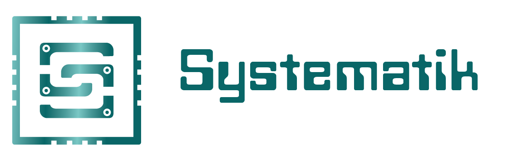
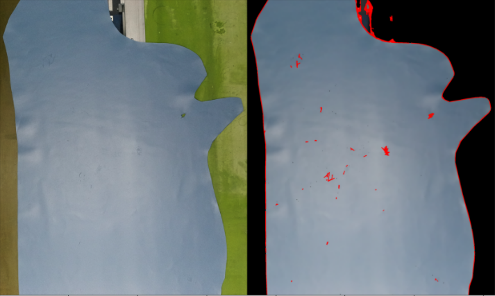

# Computer Vision System
**Systematik s.r.l. 2022**




## **Descrizoione generale**
Sistema di comunicazione ed elaborazione di immagini per l'automatizzazione dei processi industriali. Questa applicazione riconosce i difetti di produzione in maniera automatica. I difetti rilevati nei pezzi prodotti possono essere anche di piccole dimensioni. 

Le immagini vengono catturate da una videocamera 4K posta alla fine della di produzione in modo da poter rilevare in maniera automatica potendo far risparmiare molto tempo agli operatori industriali.

<br>




________________________________________________________________

## **Software**
Impara ad utilizzare OpenCV e Depthai, sono le librerie su cui si basa l'applicazione.
- Corso **OpenCV** https://courses.opencv.org/
- Documentazione ufficiale di **OpenCV** https://docs.opencv.org/4.5.5/
- Documentazione ufficiale di **Depthai** https://docs.luxonis.com/projects/api/en/latest/

## **Object Detection**
- https://onnx.ai/

## **Hardware**
Computer e processori ideali per il progetto
- https://www.lattepanda.com/products

## **Crea modelli di machine learning**
Crea modelli di reti neurali con strumenti online e gratuiti.
- https://teachablemachine.withgoogle.com/
- https://www.makesense.ai/

<br>
________________________________________________________________

## **Flusso di lavoro dell'applicazione**
Quest applicazione di Computer Vision permette di:

1. Comunica attraverso socket con il microcontrollore PLC connesso ad un sensore che avvisa dell'arrivo di un prodotto. Arriva un messaggio stringa da un client socket PLC.

2. Quando viene mandato un messaggio da PLC, l'app si attiva e scatta una foto ad una o più videocamere connesse in locale.

3. Processare la foto per verificarne la presenza di errori nel prodotto finito:

    1. la rimozione del background
    
    2. l'individuazione di contorni
    
    3. l'individuazione di errori
    
    4. la classificazione degli errori

4. riportare i risultati del sistema : 
    1. carica l'immagine originale e l'immagine elaborata su frontend nel pannello PLC (o in un frame in locale pop-up ad uso di debugging).
    2. restituisci a PLC un messaggio contente un booleno che indica la presenza o assenza dell'errore, e tipologia di errore. 


<br>

________________________________________________________________

## **Installazione**

1. installa pip, il packet manager di python  <br>
```python3 -m install pip``` 

2. aggiorna il packet manager pip <br>
```pip install -U pip```

3.  Attivazione dell'ambiente di sviluppo  
    (Mac OS / Linux)<br>
```source venv/bin/activate```

    (Windows) <br>
```venv\Scripts\activate```


4. Installare delle librerie richieste <br> 
``` pip install -r ./requirements.txt```


### **Installazione alternativa con Anaconda**
Se utilizzi l'ambiente di Anaconda (conda), puoi usare anche questo modo per installare l'ambiente di sviluppo.
1. ```conda create -n env``` <br> 
2. ```conda activate env``` <br> 
3. ```conda config --env --add channels conda-forge```<br> 
4. ```conda install --file requirements.txt```<br> 

<br>

## **Lanciare l'applicazione**
 L'app funziona solo con un socket che si connette al server ed invia dati. 
 Questi messaggi del socket sono i trigger sul dover fare una foto. 
 
 Per far partire l'applicazione o si connette il socket della PLC che manda messaggi ogni volta che bisogna scattare una foto, oppure per debugging è possibile lanciare un socket di test chiamato plc_client_test.py, dove verranno mandati messaggi random ogni tot secondi al server. Così facendo è possibile far attivare il sistema di computer vision.

________________________________________________________________

### **Modalità Debugging (test)**
In due terminali separati
```
python3 plc_test_client.py
python3 app.py
``` 
________________________________________________________________

### **Modalità Live (in real)**
Attiva la PLC che si connette con un socket al server (app.py) e lancia il seguente comando :
``` 
nohup python3 app.py 1> logs.out 2> logs.err &
``` 


<br>

# **Stack tecnologico**

## **Open CV**
OpenCV (Open Source Computer Vision Library) è una libreria di funzioni di programmazione finalizzate principalmente alla visione artificiale in tempo reale. La libreria è multipiattaforma e può essere utilizzata gratuitamente con la licenza open source Apache 2. A partire dal 2011, OpenCV offre l'accelerazione GPU per operazioni in tempo reale. OpenCV è scritto in C++ e la sua interfaccia principale è in C++, ma conserva ancora un'interfaccia C meno completa anche se estesa. Tutti i nuovi sviluppi e algoritmi vengono visualizzati nell'interfaccia C++. Ci sono collegamenti in Python, Java e MATLAB/OCTAVE. Sono stati sviluppati wrapper in diversi linguaggi di programmazione per incoraggiare l'adozione da parte di un pubblico più ampio. Nella versione 3.4, i collegamenti JavaScript per un sottoinsieme selezionato di funzioni OpenCV sono stati rilasciati come OpenCV.js, da utilizzare per piattaforme web.

<br>

## **Jupyter Notebook**

Questo progetto contiene file con l'estensione _.ipynb_ ,questi sono file di jupyter-notebook nel quale andremo a fare passo passo il progetto. 

Jupyter-notebook consente di utilizzare il linguaggio dell'applicazione (ovvero python), attraverso un interfaccia web dove è possibile testare e documentare pezzi di codice in sequenza ed anche in ordine sparso. 

Juypter permette tutto questo senza dover: testare prima il codice, commentarne delle parti durante lo sviluppo e senza dover rieseguire l'intero file. 

In definitiva, Jupyter offre un ambiente di sviluppo una di grande performance per costruire progetti complessi in diversi linguaggi di programmazione, e per questo motivo è stato scelto per costruire e documentare il codice del progetto.

<br>

## **nohup**
nohup è un comando POSIX che significa "non riattaccare". Il suo scopo è eseguire un comando tale da ignorare il segnale HUP (hangup) e quindi non interrompersi quando l'utente si disconnette.

L'output che normalmente andrebbe al terminale va in un file chiamato nohup.out, se non è già stato reindirizzato.

Possiamo usare il comando nohup per impedire che un processo termini una volta terminato il processo padre. Utilizzando i parametri di reindirizzamento, possiamo anche reindirizzare l'output da nohup a un file personalizzato.

<br>

## **sockets**
Un socket, in informatica, indica un'astrazione software progettata per utilizzare delle API standard e condivise per la trasmissione e la ricezione di dati attraverso una rete oppure come meccanismo di IPC. È il punto in cui il codice applicativo di un processo accede al canale di comunicazione per mezzo di una porta, ottenendo una comunicazione tra processi che lavorano su due macchine fisicamente separate. Dal punto di vista di un programmatore un socket è un particolare oggetto sul quale leggere e scrivere i dati da trasmettere o ricevere. 

<br>

<br>

# **Architettura software**
## **Componenti**
L'applicazione è divisa nelle seguenti componenti fisiche:

    app.py
    data/
    docs/
    tests/
    systematik_opencv.py

<br>

________________________________________________________________

### **app.py**
File dell' applicazione scritta in python di computer vision. Script finale del progetto da far girare sul server industriale. 
1. connessione con microcontrollore PLC
    1. crea un server con i sockets
    3. resta in attesa di messaggi della PLC

2. elaborazione delle fotografie
    - ritaglio sfondo
        1) elimina background automatico
        2) analisi del colore
    - disegno dei contorni
    - object detection
    - object classification

3. invia risultati alla plc
    1. si connette da client alla PLC
    2. invia i dati elaborati sottoforma di True/False
    3. invia i dati elaborati sottoforma di Classe di Difetto

<br>

________________________________________________________________

### **data/** 

    data/
        video/
            viz/    visibile
            ir/     infra rosso
            term/   termica

        img/
            viz/    visibile
            ir/     infra rosso
            term/   termica

La directory data/ contiene i dati da analizzare per la risoluzione del progetto.

Directory che contiene video ed immagini divisi per la tipologia di videocamera utilizzata.

- ```viz/``` videocamera strereo 16Mpx _openKit_ (Mega pixel) 
- ```ir/``` infra rosso 8Mpx 
- ```term/``` termica 2Mpx _flir Lepton_  


#### **_Nomenclatura dei dati_**

 I dati sono video ed immagini reali, indicate come **r_1.png** se sono immagini prese in luoghi effettivi di lavoro, ed immagini di test, indicate come **t_1.png**, se sono immagini prese in laboratorio o su internet. 

Il numero nel nome delle immagini è incrementale ed in ordine cronologicamente crescente. Le immagini partono da t_1.png e proseguono, t_2, t_3 etc...

La cartella **data/** è suddivisa nelle seguenti sottocartelle :


<br>

________________________________________________________________

### **tests/**

    tests/
        libreria/ 
        computer_vision/    
        frame_capture/     
        object_classification/   
        object_detection/
        sockets/
        
- **libreria** : Questa directory contiene il file **systematik_opencv.ipynb** che contiene tutte le funzioni che vengono documentate e testate direttamente nel notebook di jupyter potendole capire, commentare e testare in un unico file. 
- **computer_vision** : notebooks di jupyter dove è possibile testare i punti centrali delle funzioni di opencv per l'individuazione di contorni e la rimozione dello sfondo. 
- **frame_capture** : scripts per l'acquisizione di immagini e video tramite i diversi modelli di videocamera e le diverse librerie disponibili.
- **object_classification** : 
- **object_detection** : 
- **sockets** : tests su script che svolgono lavoro da client e da server. File per capire e testare i sockets.

<br>

________________________________________________________________

### **systematik_opencv.py**

Il file **systematik_opencv.py** contiene tutte le funzioni della libreria che possono essere importate come modulo e chiamate altrove. Queste funzioni vengono chiamate nell'file app.py per fornire la funzione di Computer Vision.

________________________________________________________________

<br>

### **docs/**
Questa cartella contiene tutta la documentazione riguardante il progetto. Risultati salvati, spiegazioni sul progetto e problematiche riscontrate.

    docs/
        results/
            img/       immagini
            video/     video
            other/     altro

        explanations/

        bugs/

<br>
